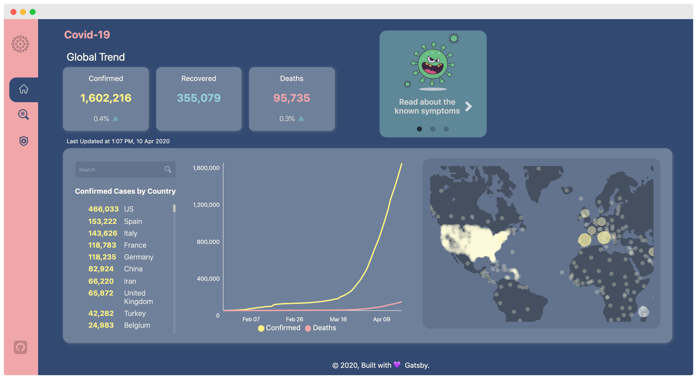

<h1 align="center">
  🦠 Covid-19 Dashboard
</h1>

[](https://app.netlify.com/sites/fight-covid19/deploys)

This dashboard aims to raise awareness on the global pandemic caused by the Covid-19 outbreak and share useful information on safety measures to fight the virus.

<br/>

[Live Demo](https://fight-covid19.netlify.app/)

## Technologies

- [Gatsby](https://www.gatsbyjs.org/) (Front-End)
- [mathdroid API](https://github.com/mathdroid/covid-19-api) (Data sourced from John Hopkins University CSSE)
- [Mapbox](https://www.mapbox.com/) (For heatmap visualisation)

## Development

To setup the app for development on your local machine, please follow the instructions below:

1. Clone the repo to your machine

```bash
git clone https://github.com/bilafish/covid-19-dashboard.git
```

2. Install necessary packages

```bash
yarn
```

3. Start the development environment

```bash
yarn develop
```
